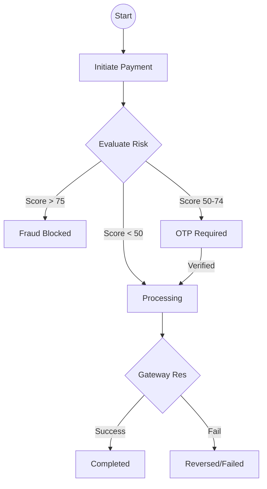

# CredVault — Low-Level Design Document

> Detailed architectural blueprint covering class designs, database schemas, API specifications, message contracts, security implementations, and testing approaches for the CredVault microservices ecosystem.

---

## Document Scope

| Area | Coverage |
|---|---|
| Class Designs | Domain Entities, CQRS Handlers, Validators |
| DB Schemas | 5 service-specific databases |
| API Spec | Ocelot Gateway routing & Service endpoints |
| Message Contracts | MassTransit Events & Sagas |
| Frontend | Angular 19 component hierarchy |
| Security | JWT · BCrypt · OTP · RS256 |

**Prerequisites:** High-Level Design (HLD) document reviewed · Technology stack finalized · Development environment setup complete.

---

## 01 — Introduction

This Low-Level Design document provides technical specifications for the CredVault platform. It translates high-level architectural patterns into implementation-ready details, ensuring consistency across the five core microservices.

---

## 02 — Identity Service

| Port | Database | Responsibility |
|---|---|---|
| `5032` | `credvault_identity` | Auth · OTP · Profile · Security |

### Architecture Layers

#### Domain Layer
`User` · `OTPCode` · `RefreshToken` · `IUserRepository` · `IOTPRepository` · `ITokenService`

#### Application Layer
`RegisterUserCommand` · `LoginUserCommand` · `SendOTPCommand` · `VerifyOTPCommand` · `ResetPasswordCommand` · `RegisterUserValidator`

#### Infrastructure Layer
`IdentityDbContext` · `BCryptPasswordHasher` · `JwtTokenGenerator` · `UserRegisteredPublisher`

---

### OTP Lifecycle Flow

#### Sequence Diagram — OTP Flow

| # | From | To | Action | Detail |
|---|---|---|---|---|
| 1 | Client | Identity Service | SendOTP Request | User triggers OTP (Login/Reset) |
| 2 | Identity | Internal | Generate Code | 6-digit numeric string |
| 3 | Identity | Internal | Hash Code | BCrypt hashing (Work Factor 12) |
| 4 | Identity | Database | Save OTP | Store Hash + Expiry (5m) |
| 5 | Identity | Notification Svc | Publish Event | `OTPSentEvent` for email delivery |
| 6 | Client | Identity Service | VerifyOTP | User submits raw 6-digit code |
| 7 | Identity | Internal | Verify Hash | Compare input vs stored hash |
| 8 | Identity | Database | Mark Used | Set `IsUsed = true` |

### Key Implementation — JWT Generation

```csharp
public string GenerateAccessToken(User user)
{
    var claims = new List<Claim>
    {
        new Claim(JwtRegisteredClaimNames.Sub, user.Id.ToString()),
        new Claim(JwtRegisteredClaimNames.Email, user.Email),
        new Claim(ClaimTypes.Role, user.Role),
        new Claim("name", user.FullName)
    };

    var key = new SymmetricSecurityKey(Encoding.UTF8.GetBytes(_config["Jwt:Secret"]));
    var creds = new SigningCredentials(key, SecurityAlgorithms.HmacSha256);

    var token = new JwtSecurityToken(
        issuer: _config["Jwt:Issuer"],
        audience: _config["Jwt:Audience"],
        claims: claims,
        expires: DateTime.UtcNow.AddMinutes(15),
        signingCredentials: creds);

    return new JwtSecurityTokenHandler().WriteToken(token);
}
```

---

## 03 — Card Service

| Port | Database | Responsibility |
|---|---|---|
| `5033` | `credvault_cards` | Card Vaulting · Issuer Detection |

### Card Masking Pipeline

```
Input: "1234567812345678"
        ↓
Detect Issuer: (4... = Visa, 5... = MasterCard)
        ↓
Generate SHA256 Hash for deduplication
        ↓
Mask: "**** **** **** 5678"
        ↓
Persist: (MaskedNumber, IssuerId, CreditLimit)
```

### Card Domain Entity Logic

```csharp
public static CreditCard Create(Guid userId, string cardNumber, ...)
{
    return new CreditCard
    {
        Id = Guid.NewGuid(),
        UserId = userId,
        MaskedNumber = $"**** **** **** {cardNumber.Substring(cardNumber.Length - 4)}",
        CardNumberHash = HashService.ComputeSha256(cardNumber),
        CreatedAt = DateTime.UtcNow
    };
}

public void UpdateOutstandingBalance(decimal amount)
{
    OutstandingBalance = Math.Max(0, OutstandingBalance + amount);
    UpdatedAt = DateTime.UtcNow;
}
```

---

## 04 — Billing Service

| Port | Database | Responsibility |
|---|---|---|
| `5034` | `credvault_billing` | Bills · Schedules · Rewards |

### Bill Status State Machine

```
[*] --> Pending: Bill Generated
Pending --> PartiallyPaid: Payment < Total
Pending --> Paid: Payment >= Total
PartiallyPaid --> Paid: Balance Cleared
Pending --> Overdue: Date > DueDate
Overdue --> Paid: Late Payment
```

### Reward Tier Calculation

| Tier | Min Points | Multiplier |
|---|---|---|
| Silver | 0 | 1x |
| Gold | 1000 | 1.5x |
| Platinum | 5000 | 2.5x |

### Implementation — Apply Payment

```csharp
public void ApplyPayment(decimal amount)
{
    AmountPaid += amount;
    Status = AmountPaid >= TotalAmount ? "Paid" : "PartiallyPaid";
    UpdatedAt = DateTime.UtcNow;
}
```

---

## 05 — Payment Service

| Port | Database | Responsibility |
|---|---|---|
| `5035` | `credvault_payments` | Saga Orchestration · Risk Score |

### Payment Saga Flow



### Risk Engine Logic

```csharp
public int EvaluateRisk(decimal amount, Guid userId)
{
    int score = 0;
    if (amount > 50000) score += 40; // High value
    if (IsUnusualTime()) score += 20; // 1 AM - 4 AM
    if (HasRecentFailures(userId)) score += 20;
    return score;
}
```

---

## 06 — Notification Service

| Port | Database | Responsibility |
|---|---|---|
| `5036` | `credvault_notifications` | Event Consumption · Email Delivery |

### Event Processing Pipeline

```
RabbitMQ Event (e.g. PaymentCompleted)
        ↓
Fetch User Email from Identity (via Event Payload)
        ↓
Fetch Email Template by Key
        ↓
Render HTML (replace {{placeholders}})
        ↓
Send via SendGrid
        ↓
Log Notification Audit
```

---

## 07 — API Gateway & Endpoint Specification

The API Gateway (Ocelot) manages cross-cutting concerns and routes traffic. Below is the exhaustive list of all internal service endpoints exposed through the gateway.

### 7.1 Identity Service Endpoints (`:5032`)

| Path | Method | Auth | Description |
|---|---|---|---|
| `/api/auth/register` | POST | No | Create user account & fire welcome event. |
| `/api/auth/login` | POST | No | Validate credentials; return JWT/Refresh tokens. |
| `/api/auth/refresh` | POST | No | Issue new JWT using valid Refresh Token. |
| `/api/auth/verify-email` | POST | No | Verify account via registration OTP. |
| `/api/auth/send-otp` | POST | No | Trigger OTP for login, payment, or reset. |
| `/api/auth/verify-otp` | POST | No | Validate a 6-digit numeric OTP. |
| `/api/auth/reset-password`| POST | No | Set new password using verified OTP. |
| `/api/users/profile` | GET | Yes | Retrieve current user profile details. |
| `/api/users/profile` | PUT | Yes | Update user profile (Name, Phone). |

### 7.2 Card Service Endpoints (`:5033`)

| Path | Method | Auth | Description |
|---|---|---|---|
| `/api/cards` | GET | Yes | List all cards associated with the user. |
| `/api/cards/{id}` | GET | Yes | Retrieve specific card metadata. |
| `/api/cards/add` | POST | Yes | Securely vault a new card (Masking + Hash). |
| `/api/cards/{id}` | DELETE | Yes | Soft-delete a card from the vault. |
| `/api/cards/default/{id}`| PUT | Yes | Set card as the primary payment method. |
| `/api/cards/verify` | POST | Yes | Execute micro-auth (₹1) to verify card. |
| `/api/cards/utilization` | GET | Yes | Calculate credit utilization percentage. |

### 7.3 Billing Service Endpoints (`:5034`)

| Path | Method | Auth | Description |
|---|---|---|---|
| `/api/bills` | GET | Yes | Retrieve paged history of monthly bills. |
| `/api/bills/{id}` | GET | Yes | Get line-item details for a specific bill. |
| `/api/bills/schedule` | POST | Yes | Schedule a future payment for a bill. |
| `/api/bills/schedule/{id}`| DELETE | Yes | Cancel a pending scheduled payment. |
| `/api/rewards` | GET | Yes | Get points balance, tier, and history. |
| `/api/rewards/redeem` | POST | Yes | Convert points to cashback or vouchers. |

### 7.4 Payment Service Endpoints (`:5035`)

| Path | Method | Auth | Description |
|---|---|---|---|
| `/api/payments/initiate` | POST | Yes | Trigger the Payment Saga state machine. |
| `/api/payments/history` | GET | Yes | Retrieve paged list of all transactions. |
| `/api/payments/{id}` | GET | Yes | Check real-time status of a payment. |
| `/api/payments/verify-otp`| POST | Yes | Validate OTP for high-risk transactions. |
| `/api/payments/risk-score/{id}`| GET | Yes | View risk assessment breakdown. |
| `/api/payment-methods` | GET | Yes | List available payment gateway channels. |

### 7.5 Notification Service Endpoints (`:5036`)

| Path | Method | Auth | Description |
|---|---|---|---|
| `/api/notifications/logs`| GET | Yes | Retrieve history of emails sent to user. |
| `/api/notifications/audit`| GET | Yes | System-wide audit log (Admin restricted). |

---

## 08 — Database Schemas

### Identity DB — `credvault_identity`

```sql
CREATE TABLE Users (
    Id UNIQUEIDENTIFIER PRIMARY KEY DEFAULT NEWID(),
    Email NVARCHAR(256) UNIQUE NOT NULL,
    PasswordHash NVARCHAR(512) NOT NULL,
    FullName NVARCHAR(100) NOT NULL,
    Role NVARCHAR(20) DEFAULT 'User',
    IsEmailVerified BIT DEFAULT 0,
    CreatedAt DATETIMEOFFSET DEFAULT GETUTCDATE()
);
```

### Payment DB — `credvault_payments`

```sql
CREATE TABLE Payments (
    Id UNIQUEIDENTIFIER PRIMARY KEY DEFAULT NEWID(),
    UserId UNIQUEIDENTIFIER NOT NULL,
    BillId UNIQUEIDENTIFIER NOT NULL,
    Amount DECIMAL(18,2) NOT NULL,
    Status NVARCHAR(20) DEFAULT 'Processing',
    CreatedAt DATETIMEOFFSET DEFAULT GETUTCDATE()
);
```

---

## 09 — Message Contracts (Events)

```csharp
// Published by Payment Service
public record PaymentCompletedEvent(
    Guid PaymentId,
    Guid UserId,
    Guid BillId,
    decimal Amount,
    Guid CorrelationId,
    DateTime Timestamp
);

// Published by Billing Service
public record RewardEarnedEvent(
    Guid UserId,
    int Points,
    string Tier,
    Guid CorrelationId
);
```

---

## 10 — Frontend Component Tree

```
AppComponent
└── ShellComponent
    ├── Navbar (Auth state, Notifications)
    └── RouterOutlet
        ├── DashboardComponent
        ├── CardsModule
        │   ├── CardListComponent
        │   └── AddCardComponent
        ├── BillingModule
        │   ├── BillDetailComponent
        │   └── RewardsSummaryComponent
        └── PaymentModule
            ├── InitiatePaymentComponent
            └── PaymentStatusComponent
```

---

## 11 — Error Handling & Testing

### Status Code Mapping
- `NotFoundException` → **404**
- `ValidationException` → **400**
- `UnauthorizedException` → **401**
- `FraudException` → **403**

### Testing Strategy
- **Unit:** xUnit for Domain Entities & Command Handlers.
- **Integration:** Testing MassTransit consumers and EF Core repositories.
- **E2E:** Playwright for critical payment journeys.

---

*CredVault LLD · v2.0 · May 2026*
