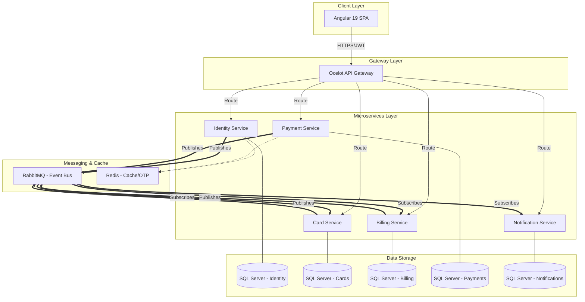

# CredVault — High-Level Design (HLD) Document

## 1. System Overview and Purpose
CredVault is a comprehensive credit card management platform designed to provide users with a single dashboard to track multiple credit cards, monitor billing cycles, initiate payments, and earn reward points. The system is built using a modern microservices architecture to ensure modularity, scalability, and independent evolution of features.

**Core Purpose:**
- Consolidate multiple credit card views into one interface.
- Automate billing cycle tracking and reminders.
- Provide a secure, risk-evaluated payment workflow.
- Engage users through a points-based rewards system.
- Ensure transparency through audit logging and real-time notifications.

---

## 2. Architecture Diagram

---

## 3. Technology Stack Choices

| Component | Technology | Rationale |
|---|---|---|
| **Frontend** | Angular 19 | High performance with Signals, standalone components for modularity, and strong typing. |
| **Backend** | .NET 10 | Enterprise-grade performance, robust ecosystem, and native support for microservices. |
| **API Gateway** | Ocelot | Lightweight, configuration-driven routing with built-in JWT validation and rate limiting. |
| **Messaging** | RabbitMQ + MassTransit | MassTransit provides high-level abstractions for Pub/Sub and complex Sagas (state machines). |
| **Database** | SQL Server | Reliable relational storage for transactional integrity across service-specific databases. |
| **Caching** | Redis | Ultra-fast storage for transient data like OTP codes and JWT blacklists. |
| **Architecture** | Clean Architecture | Enforces separation of concerns (Domain, Application, Infrastructure, API). |
| **Pattern** | CQRS (MediatR) | Decouples read and write operations, simplifying complex business logic. |

---

## 4. Component/Service Breakdown

### 4.1 identity-service
- **Role:** Handles User Identity and Access Management (IAM).
- **Responsibilities:** User registration, BCrypt password hashing, JWT/Refresh token issuance, and OTP generation for multi-factor authentication.

### 4.2 card-service
- **Role:** Manages the lifecycle of credit cards.
- **Responsibilities:** Adding/removing cards, auto-detecting card issuers via BIN, tracking outstanding balances, and monitoring card expiry.

### 4.3 billing-service
- **Role:** Orchestrates billing cycles and rewards.
- **Responsibilities:** Monthly bill generation, tracking payment status (Pending, Paid, Overdue), scheduling future payments, and managing reward point accounts/tiers.

### 4.4 payment-service
- **Role:** Executes and coordinates payments.
- **Responsibilities:** Running the **Payment Saga** (state machine), performing real-time risk evaluation, fraud detection, and generating immutable transaction logs.

### 4.5 notification-service
- **Role:** System-wide auditor and communicator.
- **Responsibilities:** Consuming all domain events to send template-based emails (via SendGrid) and maintaining a central, append-only Audit Log for the entire system.

---

## 5. Data Flow

### 5.1 Request Flow (Synchronous)
1. **User Action:** The Angular SPA sends an HTTP request with a JWT.
2. **Gateway:** Ocelot validates the JWT, injects a `CorrelationId`, and routes the request to the target service.
3. **Execution:** The service processes the request using MediatR Command/Query handlers.

### 5.2 Event Flow (Asynchronous)
1. **Trigger:** A service completes a state change (e.g., `PaymentCompleted`).
2. **Publish:** The service publishes a message to RabbitMQ via MassTransit.
3. **Consume:** Downstream services (e.g., Billing, Notification) consume the message to update their local state or trigger side-effects (e.g., send email).

### 5.3 Payment Saga Flow
- **Initiate:** User requests a payment → `PaymentInitiated` event.
- **Risk Check:** Payment Service evaluates risk score.
- **Decision:** 
    - If Low Risk: Proceed to process.
    - If Medium Risk: Suspend for OTP verification.
    - If High Risk: Block and publish `FraudDetected`.
- **Completion:** On success, publish `PaymentCompleted`. On failure, trigger compensation (reversal).

---

## 6. API Contract Overview (Surface Level)

| Service | Base Route | Key Endpoints |
|---|---|---|
| **Identity** | `/api/identity` | `/register`, `/login`, `/refresh-token`, `/send-otp`, `/verify-otp` |
| **Card** | `/api/cards` | `GET /`, `POST /add`, `DELETE /{id}`, `PUT /default/{id}`, `GET /utilization` |
| **Billing** | `/api/billing` | `GET /bills`, `GET /bills/{id}`, `POST /schedule`, `GET /rewards` |
| **Payment** | `/api/payments` | `POST /initiate`, `GET /history`, `POST /verify-payment-otp`, `GET /risk-score` |
| **Notification** | `/api/notify` | `GET /logs`, `GET /audit` |

---

## 7. Security Approach
- **Authentication:** JWT (JSON Web Tokens) for stateless auth, stored in-memory (not localStorage) in the Angular SPA.
- **Authorization:** Role-Based Access Control (RBAC) and Claim-based authorization enforced at the Gateway and Service layers.
- **MFA:** OTP-based verification for sensitive actions (Login, high-value payments) stored in Redis with 5-minute TTL.
- **Data Protection:** BCrypt (work factor 12) for passwords; sensitive card numbers are masked (`**** **** **** 1234`).
- **Network Security:** No inter-service HTTP calls; services communicate only via RabbitMQ, reducing lateral attack surfaces.

---

## 8. Scalability and Reliability Strategy
- **Horizontal Scaling:** Each microservice can be scaled independently based on load (e.g., Payment service during peak hours).
- **Service Independence:** One database per service ensures that a database failure in the Billing service doesn't crash the Identity service.
- **Eventual Consistency:** Asynchronous messaging ensures that the system remains responsive even if a downstream service (like Notifications) is temporarily unavailable.
- **Resiliency:** MassTransit provides automatic retries and Dead Letter Queues (DLQ) for failed message processing.

---

## 9. Deployment Topology
- **Containerization:** Every service and infrastructure component (SQL, Redis, RabbitMQ) is containerized using **Docker**.
- **Orchestration:** **Docker Compose** is used for local development and testing, ensuring environment parity.
- **Isolation:** Services reside in a private Docker network, with Ocelot as the only component exposed to the public network.

---

## 10. Assumptions and Constraints
- **Simulation:** Payment gateway integration is simulated; no actual money is moved via Razorpay/Stripe in this version.
- **Currency:** The system assumes a single currency (INR) for all transactions.
- **Identity:** Email is used as the primary unique identifier for users.
- **Constraint:** The system is designed for a student-sprint scope, prioritizing core patterns over production hardening (e.g., simplified retry logic).
