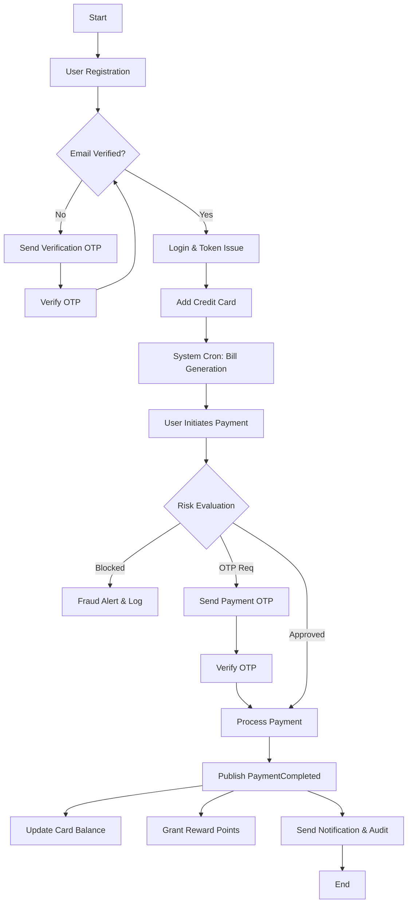
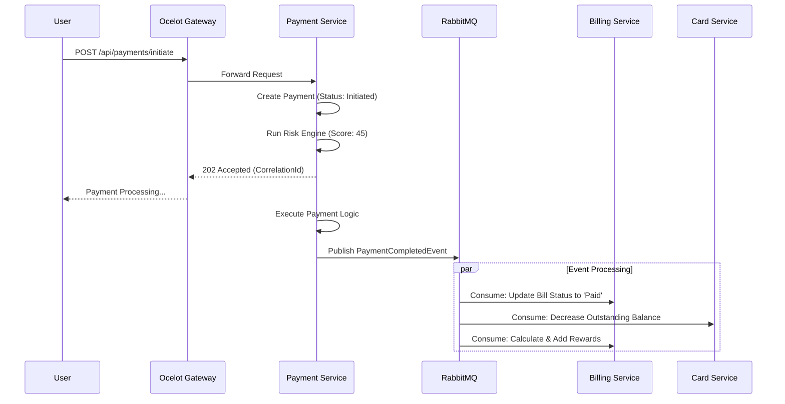

# CredVault — Low-Level Design (LLD) Document

## 1. Activity Diagram: System Workflow
This diagram represents the logical flow of user interactions across the distributed system.



---

## 2. Detailed API Design & Message Contracts

### 2.1 Identity Service API
- **Base Route:** `/api/identity`
- **Endpoints:**
    - `POST /register`: Accepts `RegisterUserRequest`. Returns 201 Created.
    - `POST /login`: Accepts `LoginUserRequest`. Returns `AuthResponse` (JWT + RefreshToken).
    - `POST /verify-otp`: Accepts `VerifyOTPRequest`. Uses Redis to validate.
    - `POST /refresh-token`: Rotates JWT using a valid RefreshToken.

### 2.2 Card Service API
- **Base Route:** `/api/cards`
- **Endpoints:**
    - `GET /`: Returns paged list of user's cards.
    - `POST /add`: Validates BIN, masks number, and saves card. Fires `CardAddedEvent`.
    - `PUT /default/{id}`: Switches the default card for the user.

### 2.3 Payment Service & Saga (The Heart of CredVault)
The Payment Service implements a state-machine based Saga using **MassTransit**.

**Saga States:**
1. `Initiated`: Payment record created.
2. `RiskCheckPassed`: Score < 75.
3. `Processing`: External gateway (simulated) call in progress.
4. `Completed`: `PaymentCompletedEvent` published.
5. `Failed`: `PaymentFailedEvent` published; cleanup triggered.

**Sequence Diagram: Payment Flow**


---

## 3. Database Schema Details

| Service | Table | Column | Type | Notes |
|---|---|---|---|---|
| **Identity** | `Users` | `PasswordHash` | `nvarchar(512)` | BCrypt Work Factor 12 |
| **Card** | `CreditCards` | `MaskedNumber` | `nvarchar(20)` | `**** **** **** 1234` |
| **Billing** | `Bills` | `Status` | `nvarchar(20)` | `Pending, Paid, Overdue` |
| **Payment** | `PaymentSagas` | `CurrentState` | `nvarchar(50)` | Managed by MassTransit |
| **Notify** | `AuditLogs` | `Action` | `nvarchar(50)` | `Created, StatusChanged, etc` |

**Indexing Strategy:**
- All `UserId` columns across services have non-clustered indexes for fast lookups.
- `CorrelationId` in `AuditLogs` is indexed for distributed tracing.

---

## 4. Algorithms & Logic

### 4.1 Risk Scoring Algorithm (Payment Service)
```csharp
public int EvaluateRisk(Payment payment) {
    int score = 0;
    if (payment.Amount > 50000) score += 40;
    if (IsUnusualTime(DateTime.UtcNow)) score += 20;
    if (HasMultipleFailedRecentPayments(payment.UserId)) score += 30;
    return score; // Thresholds: <50 Auto, 50-74 OTP, 75+ Block
}
```

### 4.2 Reward Point Logic (Billing Service)
- **Rate:** 1 Point per ₹100 spent.
- **Rounding:** Floor (e.g., ₹250 = 2 points).
- **Triggers:** Consuming `PaymentCompletedEvent`.

---

## 5. Technical Specifications

### 5.1 Inter-Service Messaging (RabbitMQ)
All messages use a shared contract from `CredVault.Shared.Contracts`.
- **Publisher Confirms:** Enabled to prevent message loss.
- **Dead Letter Exchanges (DLX):** Messages failing 3 retries are moved to `{service}.error` queue.

### 5.2 Caching (Redis)
- **OTP Storage:** Key: `otp:{userId}:{purpose}` | TTL: 300s.
- **Rate Limiting:** Sliding window counter for `/login` attempts.

### 5.3 Testing Strategy
- **Unit Tests:** `xUnit` + `FluentAssertions`.
- **Integration Tests:** `WebApplicationFactory` + `Testcontainers` for SQL and RabbitMQ.
- **Coverage:** Mandatory PR check for >75% line coverage on Business Logic projects.
